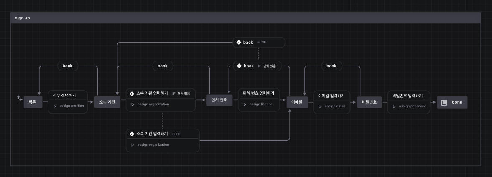

# 회원 가입 process mock up

## 개요.

이 프로젝트는 3bilion 신입 개발자 사전 과제에 따라 만들어 졌습니다.

현재 24시간 안에 주어진 문제에 맞게 구현을 완료한 상태입니다. 

## 프로젝트에 구현된 고려사항들

1. 코드의 중복을 최대한 줄이되 서로 관계가 강하게 맺히지 않게 파일 및 모듈마다 적절히 colocation 되게 했습니다. 

    예를 들어, styling을 위해 tailwind 선택하고 각 모듈 범위로 한정된 함수들은 export를 시키지 않았습니다.

    즉, 각 단계의 순서가 바뀌거나 추가되는 내용이 생기더라도 파일 1~2개에서 그리고 비슷한 영역에서 코드 수정이 이루어질 수 있습니다.

2. 개인적으로 과정이 분명하고 오류가 적어야하는 부분들은 상태 매니저 라이브러리(xstate)를 사용하여 관리했습니다.

3. 또한 문제에서는 각 단계에 validation checking이 필요한 부분을 따로 명시하였는데 이를 기반으로 테스트 코드들을 작성하였습니다.

4. 파일 명명 규칙은 보편적인 방식을 따랐으며 파일 구조는 next js에 영감받아 모듈 및 컴포넌트 단위로 폴더를 구성하여 파일들 간 거리를 좁혀놓았습니다

#### etc.

+ useful vscode extensions for this project
  
  XState VSCode (필수!, xstete의 장점이 시각화에 있는데 이 툴이 시각화를 도와줍니다.)

  

  Simple React Snippets

  ES7+ React/Redux/React-Native snippets

